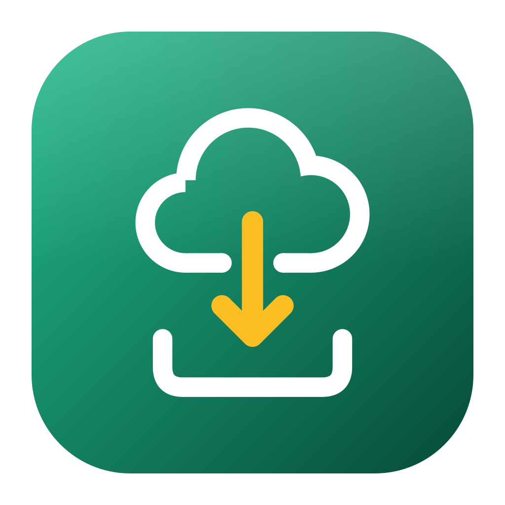

# SPVault

[](https://github.com/TarducciM/SPVault/actions/workflows/ci.yml)

**Italiano** · [English](README.en.md)

SPVault fa il backup **file per file** di una libreria SharePoint, di una sua cartella o di una
cartella di OneDrive for Business, conserva le **versioni precedenti** dei file modificati e a ogni
esecuzione **verifica che non manchi niente**. Basta poter aprire i file **nel browser**: funziona
anche da **ospite** di un'altra organizzazione, in sola lettura, senza client OneDrive, senza app
registrate su Azure e senza permessi da amministratore. Scarica solo quello che è cambiato, controlla
che sia arrivato tutto e può partire da solo ogni giorno. Per Windows.

---

## Perché esiste

Hai accesso a una libreria SharePoint o a una cartella condivisa, della tua organizzazione o di
un'altra come ospite, e vuoi tenerne una copia aggiornata e affidabile sul tuo PC o sul tuo OneDrive.

La strada più ovvia è il **download dal browser**: selezioni una cartella, premi "Scarica" e
SharePoint prepara uno zip. Funziona, ma per un backup non va bene:

- **non è garantito che lo zip contenga tutto.** Scaricando cartelle grandi capita che manchino dei
  file, e niente lo segnala: te ne accorgi quando cerchi un file che non c'è;
- **ogni volta si riscarica tutto**, anche se è cambiato un solo file;
- **tenere delle versioni costa moltissimo spazio**: ogni versione è una copia completa, quindi dieci
  backup di una cartella da 15 GB occupano 150 GB, quasi tutti uguali;
- **nessuna visibilità**: dentro uno zip non si vede cosa è cambiato, cosa è stato eliminato o se
  qualcosa è andato storto;
- **è tutto a mano**: qualcuno deve ricordarsi di farlo, aspettare lo zip, rinominarlo, spostarlo.

Le alternative "ufficiali" spesso non sono praticabili:

- **il client di sincronizzazione di OneDrive** non si può usare con le librerie di un'altra
  organizzazione a cui accedi come ospite, a meno che gli amministratori non lo abilitino;
- **rclone, Microsoft Graph, Power Automate** e simili richiedono un'app registrata su Azure o il
  **consenso di un amministratore** del tenant, che un ospite (e spesso anche un utente interno)
  non ha.

**L'idea**: se il browser può vedere e scaricare i file, può farlo anche un programma che usa **la
stessa sessione del browser e le stesse API della pagina SharePoint**. Ma lo fa bene: un file alla
volta, solo quello che è cambiato, controllando alla fine che sia arrivato tutto.

## Cosa fa

- **Il link decide cosa copiare**: il link di una libreria copia la libreria, il link di una
  cartella (anche un link di condivisione) copia solo quella cartella. Funziona anche con OneDrive
  for Business.
- Copia gli elementi scelti in `Current\`, con la **stessa struttura di SharePoint** e le stesse
  date di modifica.
- Scarica **solo i file cambiati**, riconosciuti dall'**hash del contenuto** calcolato da
  SharePoint: un file identico non viene mai riscaricato.
- File e cartelle **rinominati o spostati** su SharePoint vengono spostati anche in locale, senza
  riscaricarli.
- Conserva la **versione precedente** di ogni file modificato o eliminato in
  `_Versions\<data>_r<n>\`, tenendo solo le ultime N.
- **Verifica a ogni backup che ci sia tutto** e lo dice chiaramente: `VERIFICA OK` oppure
  `VERIFICA NON SUPERATA`, con l'elenco esatto dei file mancanti.
- Segnala a parte il contenuto che esiste su SharePoint ma **non è visibile con il tuo account**:
  nessun programma può copiarlo con quelle credenziali, ma almeno lo sai.
- Le **cartelle nuove** che compaiono su SharePoint vengono elencate da sole, evidenziate e, se vuoi,
  aggiunte automaticamente al backup (anche a quello pianificato).
- Può tenere la copia **dentro OneDrive** lasciando i file "solo online", e se il disco non basta
  **scarica a blocchi** aspettando che OneDrive liberi spazio.
- Può partire **da solo ogni giorno** (Utilità di pianificazione di Windows). Se all'orario previsto
  il PC è spento, il backup parte appena lo riaccendi.
- Interfaccia in **italiano o inglese** (automatica in base alla lingua di Windows, o a scelta).
- Si installa con un **MSI per utente** (niente permessi da amministratore) o si usa la versione
  **portabile**.

## Come funziona

### 1. Il link decide cosa copiare

Nel campo **Libreria o cartella SharePoint** si incolla un link copiato dal browser:

- il link di una **libreria**, per esempio
  `https://contoso.sharepoint.com/sites/Marketing/Shared%20Documents/Forms/AllItems.aspx`, copia la
  libreria: in **Cosa copiare** compaiono le sue cartelle e i suoi file di primo livello;
- il link di una **cartella** copia solo quella cartella: in **Cosa copiare** compare il suo
  contenuto. Vanno bene:
  - l'indirizzo nella barra del browser mentre la cartella è aperta, per esempio
    `https://contoso.sharepoint.com/sites/Marketing/Shared%20Documents/Forms/AllItems.aspx?id=%2Fsites%2FMarketing%2FShared%20Documents%2FCampagne`,
    oppure l'indirizzo diretto
    `https://contoso.sharepoint.com/sites/Marketing/Shared%20Documents/Campagne`;
  - il link ottenuto con **Copia collegamento**, sia nella forma
    `https://contoso.sharepoint.com/:f:/r/sites/Marketing/Shared%20Documents/Campagne?csf=1&web=1`
    sia come link di condivisione
    `https://contoso.sharepoint.com/:f:/s/Marketing/Ek3...Qw?e=AbC123`;
- funzionano allo stesso modo i siti di Teams (`/teams/...`), le librerie del sito principale
  (`https://contoso.sharepoint.com/Shared%20Documents/...`) e **OneDrive for Business**
  (`https://contoso-my.sharepoint.com/personal/<nome>_contoso_com/Documents/...`; l'indirizzo di
  OneDrive senza cartella copia tutti i file).

Dopo **Connetti**, accanto all'account compare l'origine, per esempio
`Origine: Shared Documents › Campagne`, e ogni elemento di **Cosa copiare** mostra la sua dimensione:
si spunta quello che si vuole copiare. La selezione è legata agli identificativi di SharePoint, non ai
nomi: una cartella rinominata resta selezionata.

Il link indica solo *che cosa* copiare: l'accesso avviene sempre con il tuo account e con i tuoi
permessi. SPVault controlla il link prima di connettersi e, se non va bene (il link di un sito invece
che di una libreria, il link di un file invece che di una cartella, un link di condivisione scaduto),
spiega quale link serve.

Se cambi il link e indica un'altra libreria o cartella, la selezione si azzera e SPVault chiede di
scegliere di nuovo cosa copiare, così i backup non si mescolano. Per copiare un'altra libreria o
cartella usa anche un'altra cartella di backup: nella stessa, i file del link precedente
finirebbero in `_Versions\` perché non più selezionati.

### 2. Accesso: un browser dedicato

SPVault avvia **Chrome o Edge già installati** (prova prima Chrome, poi Edge) tramite
[Playwright](https://playwright.dev/python/), con un **profilo separato** che non tocca il browser
che usi tutti i giorni: `%LOCALAPPDATA%\SPVault\browser_profile`. Non viene scaricato nessun browser.

- **La prima volta** il browser si apre in una finestra: accedi come al solito (anche con
  l'autenticazione a più fattori) e rispondi **Sì** quando Microsoft chiede se vuoi restare
  connesso.
- **Le volte successive** il browser parte **invisibile**, riusa la sessione salvata e si chiude
  subito, dopo aver passato a SPVault i **cookie di sessione** di SharePoint e lo **User-Agent** del
  browser.
- **Le chiamate alle API** le fa SPVault con quei cookie. Lo User-Agent serve perché le API v2.0 di
  SharePoint rifiutano la sessione del browser (errore 403) se la richiesta non si presenta come un
  browser.
- **Se la sessione scade** a metà backup, SPVault la rinnova in background con il browser invisibile
  e continua.
- **Se Microsoft chiede di nuovo le credenziali**, SPVault se ne accorge in pochi secondi invece di
  restare in attesa: dalla finestra apre il browser per l'accesso, nel backup pianificato mostra un
  avviso.

SPVault vede esattamente quello che vedi tu nel browser: stessi permessi, nessun privilegio in più.
A parte le pagine di accesso di Microsoft aperte nel browser, comunica solo con SharePoint: nessun
server intermedio, nessuna telemetria.

### 3. Elenco dei file: l'API "delta"

L'elenco arriva dall'API **delta** di SharePoint (`/_api/v2.0/drives/{id}/root/delta`):

- **la prima volta** restituisce tutta la libreria: per le librerie grandi servono alcuni minuti;
- **le volte successive**, grazie al token salvato, restituisce **solo le modifiche**: pochi secondi;
- **ogni 7 giorni** c'è comunque una rilettura completa, per sicurezza (anche prima, se SharePoint
  considera scaduto il token).

L'albero della libreria viene salvato in un database SQLite locale insieme agli identificativi di
file e cartelle, e i percorsi vengono ricostruiti da lì. Così una cartella **rinominata o spostata**
su SharePoint viene riconosciuta e **spostata** anche in locale, invece di essere riscaricata. Il
database si aggiorna in un'unica transazione: se la lettura si interrompe, la volta dopo si riparte
dall'ultimo stato completo.

Se il link è di una cartella e il tuo account non può leggere tutta la libreria (capita da ospite, con
il link di una sola cartella), SPVault legge solo quella cartella, sottocartella per sottocartella con
l'API "children". In questo caso l'elenco delle modifiche non è disponibile e ogni backup rilegge
tutta la cartella; il confronto con l'hash evita comunque di riscaricare i file invariati.

### 4. Cosa scaricare: l'hash del contenuto

Per ogni file SharePoint calcola un'impronta del contenuto, il **quickXorHash**. SPVault la confronta
con quella del file già salvato nel backup:

| Situazione                                             | Cosa fa SPVault                                       |
|--------------------------------------------------------|-------------------------------------------------------|
| file identico su SharePoint                            | niente                                                |
| su SharePoint è cambiata solo una colonna o i metadati | niente (il contenuto è lo stesso)                     |
| file rinominato o spostato su SharePoint               | lo sposta dentro `Current\`, senza scaricarlo         |
| contenuto modificato su SharePoint                     | la vecchia copia va in `_Versions\`, scarica la nuova |
| file nuovo su SharePoint                               | lo scarica                                            |
| file eliminato su SharePoint, o non più selezionato    | sposta la copia locale in `_Versions\`                |
| file cancellato da `Current\` o di dimensione diversa  | lo riscarica                                          |
| file in `Current\` che non esiste su SharePoint        | lo sposta in `_Versions\`                             |

Per capire se un file locale è ancora al suo posto SPVault legge solo nome, dimensione e data, senza
aprirlo: i file "solo online" di OneDrive non vengono mai riscaricati dal cloud per controllarli.

### 5. Download

- **4 in parallelo**, ciascuno prima in una cartella temporanea (`%LOCALAPPDATA%\SPVault\tmp`);
- **l'hash si calcola durante il download** e deve coincidere con quello di SharePoint. Se non
  coincide il file viene riscaricato; se ancora non coincide viene tenuto con un avviso nel log
  (succede con alcuni file Office, vedi le [domande frequenti](#domande-frequenti));
- **se la connessione cade**, il download **riprende da dove si era fermato**;
- **gli errori temporanei** (troppe richieste, server occupato) vengono ritentati con attese
  crescenti, rispettando i tempi indicati da SharePoint;
- **solo a download completo** il file viene spostato in `Current\`, con la data di modifica di
  SharePoint: in `Current\` non finiscono file a metà. Se esisteva una versione precedente, prima
  viene spostata in `_Versions\`.

### 6. Versioni

```
<cartella di backup>\
  Current\                   copia aggiornata, stessa struttura di SharePoint
  _Versions\2026-09-21_r1\   versioni precedenti dei file modificati o eliminati in quel backup
  _Versions\2026-09-22_r1\
  _Logs\2026-09-22_r1.log    tutto quello che è stato fatto in quel backup
  _FileList.csv              ogni file con dimensione, data, hash e stato
```

- **L'etichetta** è la **data** più il **numero di revisione** del giorno: `_r1`, `_r2`, …
- **Una cartella in `_Versions\`** contiene solo i file cambiati in quel backup, non una copia
  completa: dieci versioni occupano poco più di una copia sola, non dieci volte tanto. Un backup in
  cui non cambia niente non crea cartelle di versioni.
- **Si tengono le ultime N cartelle** di versioni (**Versioni da conservare**, 10 di default); le
  più vecchie vengono eliminate. Dei log si tengono gli ultimi 100.
- **Da `Current\` non si cancella niente**: i file eliminati su SharePoint, o che non fanno più parte
  della selezione, vengono spostati in `_Versions\`. Togliere la spunta a una cartella quindi sposta
  la sua copia in `_Versions\`, dove resta finché quella versione non esce dalle ultime N.
- **Se SharePoint all'improvviso non restituisce nessun file** per la selezione mentre il backup ne
  contiene, SPVault si ferma invece di archiviare tutto.
- **Il resto della cartella di backup non viene toccato**: SPVault lavora solo in `Current\`,
  `_Versions\`, `_Logs\` e `_FileList.csv`.

### 7. Verifica di completezza

È il motivo principale per cui SPVault esiste. A ogni backup:

1. **L'elenco è completo?** SharePoint dichiara la dimensione totale di ogni cartella. SPVault la
   confronta **al byte** con la somma dei file che ha in elenco. Se una cartella non torna, scende
   solo nelle sottocartelle che non tornano (API "children"), **recupera i file mancanti** e toglie
   quelli che non esistono più. Se le differenze sono così diffuse da richiedere più di 500 cartelle
   da controllare, quelle rimaste vengono segnalate come `NON VERIFICATA`.
2. **Su disco c'è tutto?** Ogni file dell'elenco deve essere in `Current\` con il contenuto attuale
   di SharePoint. I mancanti vengono riscaricati subito.
3. **L'esito**, nel log, nella finestra e nella riga di stato:
   - `VERIFICA OK: tutti i N file visibili (X GB) sono in Current, identici a SharePoint`, oppure
   - `VERIFICA NON SUPERATA: N file mancanti`, con l'elenco nel log e in `_FileList.csv` e un avviso
     a schermo. Il backup successivo riprova.
4. **Il contenuto che il tuo account non vede.** Se SharePoint conta in una cartella più elementi (o
   più byte) di quelli visibili al tuo account, la differenza viene segnalata come `NON ACCESSIBILE`,
   con cartella, numero di elementi e dimensione, e il riepilogo aggiunge una riga `ATTENZIONE`. Non
   fa fallire la verifica, perché con il tuo account non si può copiare.

`_FileList.csv` elenca ogni file con **Percorso**, **Dimensione (byte)**, **Modificato su
SharePoint**, **quickXorHash** e **Stato** (`OK`, `MANCANTE` oppure `NON ACCESSIBILE`). I campi sono
separati da punto e virgola e il file si apre con Excel.

### 8. OneDrive e spazio sul disco

La cartella di backup può stare dentro OneDrive, così la copia finisce anche nel cloud.

- **Con l'opzione "solo online"** (*Dopo l'upload su OneDrive lascia i file solo online*, attiva di
  default) ogni file copiato viene marcato come "Libera spazio": OneDrive lo carica e poi lo toglie
  dal disco locale.
- **I controlli leggono solo nome, dimensione e data** dei file locali, quindi i file "solo online"
  non vengono mai riscaricati da OneDrive.
- **I percorsi più lunghi di 260 caratteri** sono gestiti.

**Quando il disco non basta** (per esempio 260 GB da scaricare e 100 GB liberi), SPVault **scarica a
blocchi**, purché la cartella di backup sia dentro OneDrive e l'opzione "solo online" sia attiva:

1. scarica finché restano almeno 3 GB liberi, verificando l'hash di ogni file;
2. ogni file copiato viene marcato "Libera spazio": OneDrive lo carica e, solo quando è
   **sincronizzato col cloud**, lo toglie dal disco. Il file che diventa "solo online" è il segnale
   che è stato caricato e che lo spazio è davvero libero;
3. quando il disco è pieno aspetta, con la riga di stato
   `In attesa di OneDrive: N file da caricare, X liberi sul disco...`, e riparte appena c'è posto per
   il file successivo;
4. se OneDrive non libera niente per 30 minuti (per esempio perché è chiuso o in pausa), il backup
   si ferma con un messaggio chiaro. Il backup successivo riprende da lì, senza riscaricare quello
   che c'è già;
5. un file più grande di tutto lo spazio che si può liberare viene segnalato come `MANCANTE`.

Le cartelle OneDrive vengono riconosciute anche quando sono librerie SharePoint o di Teams
sincronizzate, perché OneDrive le elenca nel registro di Windows. Se la cartella di backup non è in
OneDrive e lo spazio non basta, SPVault si ferma prima di iniziare a scaricare e spiega cosa fare.

### 9. Cartelle nuove

L'elenco di **Cosa copiare** si rilegge a ogni apertura di SPVault (in background, senza aprire il
browser), a ogni **Connetti** e a ogni backup, anche quello pianificato. Una cartella (o un file)
comparsa su SharePoint dopo l'ultima lettura:

- compare nella finestra con il segno `- NUOVA` e viene scritta nel log:
  `Nuova cartella su SharePoint: <nome>`;
- con l'opzione **Copia anche le cartelle nuove che compariranno su SharePoint** (attiva di default)
  viene aggiunta da sola alla selezione, così finisce già nel prossimo backup, anche in quello
  pianificato.

Le sottocartelle nuove dentro cartelle già selezionate vengono sempre copiate: fanno parte della
cartella scelta.

### 10. Backup automatico

- **Pianifica** crea l'attività giornaliera `SPVault` nell'Utilità di pianificazione di Windows,
  per il tuo utente e **senza permessi da amministratore**. L'attività esegue `SPVault.exe --run`
  con le impostazioni della finestra (link, cartella di backup, selezione, opzioni, lingua).
  **Rimuovi** la cancella; accanto compare `(attivo)` o `(non pianificato)`.
- **L'attività resta anche dopo spegnimenti e riavvii.** Se all'orario previsto il PC era spento o
  in sospensione, il backup parte **appena possibile** alla riaccensione. Parte anche a batteria,
  non ha limiti di durata e attende che ci sia la rete. Gira nella tua sessione di Windows, quindi
  parte quando hai effettuato l'accesso.
- **In modalità `--run`** SPVault non apre finestre e non mostra mai il browser. Se la sessione è
  scaduta compare un avviso di Windows che chiede di aprire SPVault e premere **Connetti**; se la
  verifica non è superata, un avviso con il riepilogo. L'esito di ogni esecuzione è in
  `%LOCALAPPDATA%\SPVault\scheduled_backup.log`, oltre che nel log in `_Logs\`.
- **Due backup contemporanei** (finestra e attività pianificata) non sono possibili: il secondo si
  ferma subito con `C'è già un backup in corso`.
- **Disinstallando SPVault dall'MSI** si toglie anche l'attività pianificata.

## Installazione e uso

### Requisiti

- Windows 10 o 11 a 64 bit;
- Google Chrome o Microsoft Edge installato (serve per l'accesso);
- un account che possa aprire la libreria o la cartella nel browser.

### Download

Dall'ultima **[release](https://github.com/TarducciM/SPVault/releases/latest)** scarica uno dei due
file:

| File                                   | Cosa è                                                      |
|----------------------------------------|-------------------------------------------------------------|
| `SPVault_<versione>_x64_en-US.msi`     | **Installer (consigliato)**, per utente, senza admin        |
| `SPVault_<versione>_x64-portable.exe`  | Portabile: nessuna installazione, si avvia da dove vuoi     |

L'**installer** mette il programma in `%LOCALAPPDATA%\Programs\SPVault` e fa scegliere:

- il **collegamento nel menu Start** (attivo di default);
- il **collegamento sul desktop**;
- l'**avvio all'accesso a Windows** (attivo di default): SPVault si apre ridotto a icona e aggiorna
  subito cartelle e dimensioni;
- la **lingua dell'app**: automatica, italiano o inglese (si può cambiare anche dopo, dalla
  finestra).

Si disinstalla da "App e funzionalità", e la disinstallazione toglie anche il backup pianificato.
I dati dell'app (impostazioni, sessione, stato) restano, così una reinstallazione riparte da dove
eri; per eliminarli cancella `%LOCALAPPDATA%\SPVault`.

La **versione portabile** va bene per una prova. Se però pianifichi il backup e poi sposti o cancelli
il file, l'attività pianificata smette di funzionare, perché punta a dove si trovava l'exe.

### Primo avvio

1. Avvia SPVault. La prima volta i campi sono vuoti.
2. Incolla nel campo **Libreria o cartella SharePoint** il link della libreria o della cartella da
   copiare (vedi [Il link decide cosa copiare](#1-il-link-decide-cosa-copiare)) e scegli la
   **Cartella di backup** con **Sfoglia...**.
3. Premi **Connetti**. La prima volta si apre il browser: accedi e rispondi **Sì** quando Microsoft
   chiede se vuoi restare connesso. Accanto a **Connetti** compaiono `Connesso come <account>` e
   l'origine (`Origine: ...`), e in **Cosa copiare** gli elementi del link, ciascuno con la sua
   dimensione.
4. Spunta cosa copiare. Sotto vedi il totale selezionato, lo spazio libero sul disco e l'ora in cui
   le dimensioni sono state aggiornate; si aggiornano da sole all'apertura di SPVault e a ogni
   backup.
5. Premi **Esegui backup**. La barra e la riga di stato mostrano sempre la fase in corso e i secondi
   trascorsi:

   ```
   Accesso a SharePoint → lettura delle modifiche → verifica dell'elenco → download (percentuale)
   → verifica dei file su disco → pulizia e versioni → ✓ VERIFICA OK
   ```

   **Ferma** interrompe il backup; il successivo riprende da dove si era fermato.
6. Per il backup automatico imposta l'orario in **Backup automatico ogni giorno alle** e premi
   **Pianifica**.

Il **primo backup** legge l'elenco completo e scarica tutto quello che hai selezionato. I successivi
scaricano solo le differenze: un backup senza modifiche dura pochi secondi. Per dare un'idea: su una
libreria di circa 260 GB e 228.000 elementi la prima lettura completa ha richiesto circa 12 minuti,
le successive pochi secondi, e i download sono andati a circa 25 MB/s.

### Opzioni

- **Versioni da conservare**: quante cartelle di versioni tenere in `_Versions\` (10 di default).
- **Dopo l'upload su OneDrive lascia i file solo online (non occupano spazio sul PC)**: vedi
  [OneDrive e spazio sul disco](#8-onedrive-e-spazio-sul-disco). Fuori da OneDrive non ha effetto.
- **Copia anche le cartelle nuove che compariranno su SharePoint**: vedi
  [Cartelle nuove](#9-cartelle-nuove).
- **Lingua / Language**: `Automatica / Automatic` (italiano se Windows è in italiano, altrimenti
  inglese), `Italiano` o `English`. Il cambio è immediato, anche durante un backup, e vale anche per
  il backup pianificato, i log e `_FileList.csv`.

SPVault gestisce un link e una cartella di backup alla volta: quelli nella finestra, usati anche dal
backup pianificato.

## File dell'app

In `%LOCALAPPDATA%\SPVault`:

| File                     | Contenuto                                                          |
|--------------------------|--------------------------------------------------------------------|
| `config.json`            | impostazioni della finestra                                        |
| `browser_profile\`       | profilo del browser dedicato: contiene la sessione di accesso      |
| `state_*.sqlite`         | albero della libreria e stato del backup                           |
| `scheduled_backup.log`   | esito dei backup pianificati                                       |
| `tmp\`                   | download in corso                                                  |

`browser_profile\` dà accesso ai tuoi file SharePoint come una password: non condividerlo.
Cancellarlo equivale a uscire dall'account; al prossimo **Connetti** si rifà l'accesso.

Se `state_*.sqlite` va perso non si riscarica tutto: SPVault riconosce i file già presenti in
`Current\` da dimensione e data.

## Domande frequenti

**`Non connesso: premi "Connetti"`.** La sessione è scaduta, oppure la tua organizzazione chiede di
ripetere l'accesso dopo un certo tempo. Premi **Connetti** e accedi di nuovo nella finestra del
browser. Rispondere **Sì** alla domanda "restare connesso?" allunga la durata della sessione.

**Il link non viene accettato.** SPVault spiega il motivo:

- `Il link è di un sito, non di una libreria`: apri nel browser la libreria o la cartella da copiare
  e copia il link dalla barra degli indirizzi;
- `Il link è di un file, non di una cartella`: copia il link della cartella che contiene il file;
- `Link di condivisione non valido, scaduto o non accessibile con questo account`: apri il link nel
  browser con lo stesso account; se non si apre, chiedi un nuovo link a chi l'ha condiviso.

**`VERIFICA NON SUPERATA`.** Alcuni file non sono stati scaricati (errori di rete, disco pieno,
errori del server…). L'elenco è nel log in `_Logs\` e in `_FileList.csv` (stato `MANCANTE`). Il
backup successivo li riprova.

**`NON ACCESSIBILE`.** SharePoint conta elementi che il tuo account non può vedere, per esempio
cartelle con permessi diversi. Nessun programma può copiarli con il tuo account: per averli bisogna
chiedere l'accesso a chi gestisce il sito.

**`Spazio su disco insufficiente`.** Compare solo se la cartella di backup non è dentro OneDrive, o
se l'opzione "solo online" è disattivata. Le soluzioni: mettere la cartella di backup in OneDrive con
"solo online" attivo, così SPVault scarica a blocchi; selezionare meno cartelle; liberare spazio.

**`OneDrive non ha liberato spazio negli ultimi 30 minuti`.** Durante lo scaricamento a blocchi
OneDrive deve caricare i file per liberare il disco. Controlla che OneDrive sia avviato, connesso e
non in pausa, poi rilancia il backup: riprende da dove si era fermato.

**Un file Office ha `ATTENZIONE: il file scaricato non corrisponde all'hash di SharePoint`.** Alcune
librerie modificano i documenti Office al momento del download (per esempio per inserire le colonne
della libreria nel file). Il file viene tenuto e segnalato nel log.

**I blocchi appunti OneNote non vengono copiati.** Non sono file ma raccolte speciali: vengono
saltati e segnalati nel log (`Salto ... (blocco appunti OneNote, non è un file)`).

**`Impossibile avviare Chrome o Edge`.** SPVault usa il Chrome o l'Edge installato sul PC: installane
uno dei due. Non serve che sia il browser predefinito.

**L'antivirus segnala l'exe.** Gli eseguibili creati con PyInstaller a volte vengono segnalati per
errore. Puoi controllare che il file venga dalla pagina delle release di questo repository, oppure
avviare SPVault da sorgente (vedi [Sviluppo](#sviluppo)).

**SPVault aggira i permessi o le regole della mia organizzazione?** No. Usa il tuo accesso e vede
solo quello che vedi tu nel browser. Prima di tenere una copia di dati di altri, verifica che le
regole di chi li gestisce lo consentano.

**Come segnalo un problema?** Apri una segnalazione su
[GitHub Issues](https://github.com/TarducciM/SPVault/issues) indicando la versione di SPVault (è nel
titolo della finestra), la versione di Windows, cosa stavi facendo, il messaggio che hai visto e le
righe rilevanti del log (`_Logs\<data>_r<n>.log` o `scheduled_backup.log`). Prima di allegare un log
togli i nomi di file, cartelle e account che non vuoi rendere pubblici, e non incollare mai link di
condivisione né il contenuto di `browser_profile\`.

## Sviluppo

```
spvault.py                     l'intera app: finestra, accesso, backup, verifica, --run, --minimized, --selftest
tests/fakes.py                 server SharePoint simulato (drives, children, delta, download, guasti)
tests/conftest.py              fixture: cartella dati isolata, server simulato, finestra
tests/test_*.py                test: hash, utilità, scenari di backup completi, spazio su disco, finestra, lingue
requirements.txt               dipendenze dell'app (playwright, requests)
requirements-dev.txt           in più: pytest, ruff, pyinstaller, pillow
build.ps1                      crea dist\SPVault.exe e ne esegue l'autotest
build_msi.ps1                  crea dist\SPVault_<versione>_x64_en-US.msi
installer/SPVault.wxs          installer MSI per utente (WiX 5)
assets/make_icon.py            disegna l'icona (spvault.ico, spvault.png) e la social preview
.github/workflows/ci.yml       lint, test e build di exe e MSI
.github/workflows/release.yml  release in bozza da un tag vX.Y.Z
```

Serve Python 3.12 o successivo su Windows. Non serve `playwright install`: SPVault usa il Chrome o
l'Edge già installati.

```powershell
python -m pip install -r requirements-dev.txt
python spvault.py                                   # avvio da sorgente
python -m ruff check .
python -m pytest                                    # nessun accesso a Internet: usa il server simulato
.\build.ps1                                         # dist\SPVault.exe + autotest (--selftest)
dotnet tool install --global wix --version 5.0.2    # una volta sola (richiede il .NET SDK)
.\build_msi.ps1                                     # installer MSI
```

Opzioni della riga di comando:

| Opzione        | Effetto                                                                 |
|----------------|-------------------------------------------------------------------------|
| *(nessuna)*    | apre la finestra                                                        |
| `--run`        | backup senza finestra (usato dall'attività pianificata)                 |
| `--minimized`  | apre la finestra ridotta a icona (avvio all'accesso a Windows)          |
| `--selftest`   | controlla che l'exe contenga tutto il necessario (usato dalla CI)       |

- **I test** simulano un server SharePoint completo, compresi i guasti: connessione che cade a metà
  download, sessione scaduta, hash sbagliato, file assenti dall'elenco delta, file "fantasma",
  download impossibili, contenuto non accessibile, token delta scaduto, percorsi oltre i 260
  caratteri, disco troppo piccolo con un OneDrive simulato che libera spazio (o non lo libera).
  L'hash è confrontato con una traduzione fedele dell'implementazione di riferimento di Microsoft.
- **I testi dell'interfaccia** sono scritti in italiano dentro `tr("...")`; la traduzione inglese va
  nel dizionario `EN` di `spvault.py`. I test controllano che ogni testo abbia la sua traduzione, con
  gli stessi segnaposto, e che non ci siano traduzioni inutilizzate.
- **La CI** (`ci.yml`, GitHub Actions su Windows) parte a ogni push su `main` e a ogni pull request:
  esegue lint e test su Python 3.12 e 3.14, compila exe e MSI, esegue l'autotest dell'exe e pubblica
  entrambi come artifact.
- **La release** (`release.yml`) parte da un tag `vX.Y.Z`:
  - controlla che il tag coincida con `__version__` in `spvault.py`;
  - rifà lint e test;
  - compila `SPVault_<versione>_x64-portable.exe` e `SPVault_<versione>_x64_en-US.msi`;
  - crea una **release in bozza** con i due file e le note (tabella dei download più l'elenco delle
    modifiche preparato da GitHub);
  - se qualcosa va storto elimina la bozza (il tag resta: basta rilanciare il workflow).

  La bozza si controlla e si pubblica a mano da GitHub:

  ```powershell
  # aggiornare __version__ in spvault.py e CHANGELOG.md, commit, poi:
  git tag v0.1.0
  git push origin v0.1.0
  ```

## Licenza

[MIT](LICENSE) © 2026 Michele Tarducci. Gli eseguibili delle release includono componenti di terze
parti (Python, Tcl/Tk, Playwright con Node.js, requests e altri), ciascuno con la propria licenza:
vedi [THIRD-PARTY-NOTICES.md](THIRD-PARTY-NOTICES.md).

SPVault è un progetto indipendente, non affiliato a Microsoft. SharePoint, OneDrive e Microsoft Edge
sono marchi di Microsoft; Google Chrome è un marchio di Google.
